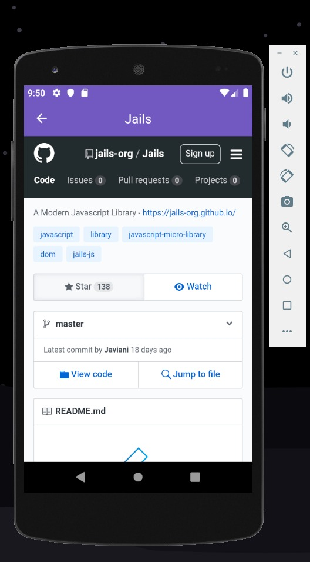

# Bootcamp_Rocketseat_React_Native
- Rocketseat course challenge of training on React.
- Desafio do curso da Rocketseat sobre React Native.

- This is a Github API consuming application that adds and removes repositories and shows each user's starred repositories.
- Este é um aplicativo que consome API do Github que adiciona e remove repositórios e mostra repositórios salvos de cada usuário.

# Screen 01:
- Screen thats adds, removes one or remove all repositories.
- Tela que adiciona, remove um ou remove todos os repositórios.

# Screen 02:
- Screen showing user repositories.
- Tela mostrando repositorios dos usuários.

# Screen 03:
- Screen showing a clicked repository.
- Tela mostrando um repositório clicado.

